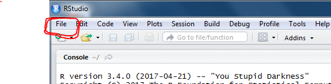

```{r setup, include=FALSE}
knitr::opts_chunk$set(echo = TRUE, fig.width=6, fig.height=3)
```

## Goals for Lab 1

At the end of this lab you should be able to...

* Import data into R
* Save data in R as variables
* Plot diversity data as a scatterplot and a boxplot
* Plot certain parts of your data


## 1. Getting Started

You will be using **R** for data analysis this semester. **R** is a versatile, free, data-handling software widely-used by scientists. Here are some great reasons to use **R**:

* You write down the instructions (code) to do your data analysis so you will remember how it's done
* Instantly rerun your analysis
* Make beautiful plots
* Analyze your data in every possible way

More great information on R is at [http://www.datacarpentry.org/R-ecology-lesson/00-before-we-start.html#why_learn_r](http://www.datacarpentry.org/R-ecology-lesson/00-before-we-start.html#why_learn_r)


### 1a. Using RStudio
Log in to the R Studio server at https://celsrs.uri.edu/ . This server will enable you to run the R software to analyze your data.

You will get your login information from your TA. Your password is the same as username.

**Open RStudio and make a new project.**

* Select from top left corner:  
    + `File` - `New Project...`
    + `New Directory` and `Empty Project` 
    + `Directory name:  FieldSampling`
    + Leave the Subdirectory as the default:  ~
    

                                  
* Select from top left corner:  
    + `File` - `New File` - `R Script`
  


Making a new project and script will give you four windows open in R: 
a *script* to help you keep track of the commands you are entering, 
a *console* where those commands are run, 
an *environment* that show what data you have, and 
a *file* window.


## 2. How to get your data into R so you can use it

Last week you calculated the diversity index for your plankton samples. A diversity index allows you to understand the variation in diversity among site types.
The following lines of code will allow you to get your data (the class data about the diversity of each plot) into R directly from Google Sheets.

### 2a. Make the tools you need available in R.

The tools you need are found in "packages". Packages are like books from the library; packages are pre-written bundles of code that can perform the tasks we want. 

```{r }
library(gsheet)
```

**Type the code (from the grey boxes) into the SCRIPT window of RStudio. Run each line using the Run button (top right of the SCRIPT window in RStudio)**


### 2b. Tell R where to get your data.

Assign the web address of the data (the "https" address) to a variable (here our variable is called "url" for "uniform resource locator". This is the term for an address on the web (you can name your variable anything though). You assign a number or word or data to a variable using `<-` (which makes something that looks like an arrow). The variable name goes on the left of the arrow and the information goes on the right. 

```{r echo=FALSE}
url <- 'https://docs.google.com/spreadsheets/d/1HXZVAtbOke47md6rT_6B3j3i_kpWtuGecKVORQhPi7c'
```

```{r eval=FALSE}
url <- 'https://docs.google.com/spreadsheets/d/1HXZVAtbOke47md6rT_6B3j3i_kpWtuGecKVORQhPi7c'
```

### 2c. Assign the data to a variable

In this case the data is contained in the variable `diversitydata`. The function `gsheet2tbl` gets the data from the website so that you can access it in R.

```{r gsheet}
diversitydata <- gsheet2tbl(url)
```

* you will need to run each line separately (put the cursor on each line and click run)
* the line was run correctly if you get the prompt (`>`) in the console window at the bottom of RStudio
* view your data by clicking on the item in the Data window on the right side (my data is called `diversitydata` - yours may be named something else) - this will open a new tab above so you can look at the data

## 3. Keep track of what your commands do

As you work you are typing commands that you probably won't remember next week. 
**Use the `#` symbol to explain your lines of code.** For example, rather than the plain code above your script might look like the following:

```{r gsheet2, eval=FALSE}
#load the package that allows use to access google sheets 
library(gsheet)

#assign the website address for the data to a variable using an arrow <-
# "variable" <- "website address for data"
url<-'https://docs.google.com/spreadsheets/d/1HXZVAtbOke47md6rT_6B3j3i_kpWtuGecKVORQhPi7c'

#load the data from google sheets
# "variable" <- "command to work on" (data from last line)
diversitydata <- gsheet2tbl(url)
```

**Use the # symbol to add comments to your script as you enter the commands below**

## 4. Plot your data

To compare the diversity values among site types we need to plot the values for each site type.

### 4a. Load the library that allows us to create plots

```{r loadlibrary}
library(ggplot2)
```

### 4b. Create the base layer of your plot 

* use the command `ggplot`
    + enter the name of the variable containing your data
    + `aes` specifies the "aesthetics" of the plot (i.e. how it looks), including the x and y variables
    + specify the variable names based on viewing the data
* run this plot command

```{r }
ggplot(diversitydata, aes(x=Tide,y=Diversity))
```

**SAVE your work**. Save your code by clicking `File > Save`. **Name your file Lab1_YourName.rproj.** Your work will save to the server that we are using for this lab.  You will be able to access your work on this server from other computers, as long as you know the web address and your username and password.


### 4c. Add data points to your plot

* now that you have set up your plot add your points using `geom_point()`
* put a `+` between the `ggplot` command and `geom_point()`

```{r }
#insert comment here
ggplot(diversitydata, aes(x=Tide,y=Diversity))+
  geom_point()
```

**Add real comments to your script**

### 4d. Add a boxplot on top of your plot

* a boxplot summarizes your data by plotting 
    + the median (middle) value as a horizontal line
    + the middle half of the data as a box
    + the remaining top and bottom quarters of the data as lines above and below the box
  
* add a boxplot using `geom_boxplot()`
* put a `+` between the `geom_point()` command and `geom_boxplot()`
* note the `+` must come at the end of a line or the command will terminate and not plot another layer

```{r }
#insert comment here
ggplot(diversitydata, aes(x=Tide,y=Diversity))+
  geom_point()+
  geom_boxplot()
```

**Adjust comments as needed**

* in order to see both the box and the points plot the box first then the point layer on top
  + note: the order of the plotting instructions specifies how the plot is made - i.e. first the base, then the points, then the box covering the points
* plot just the boxplot as this is the typical way to visualize the data


## 5. Edit your boxplots

### 5a. Reorder data on the X-axis

In some cases you might want to have your data in a particular order.

* plot outgoing on the left and incoming on the right side of the plot
* `scale_x_discrete` allows you to change all the information on the x axis
  + limits specifies the range of data on the x axis - since the data are categorical not continuous (e.g. from 1-10) you put the items in a list

```{r }
#insert comment here
ggplot(diversitydata, aes(x=Tide,y=Diversity))+
  geom_point()+
  geom_boxplot()+
  scale_x_discrete(limits=c("outgoing", "incoming"))
```


### 5b. Add labels to your plot

* use `scale_x_discrete` to relabel the category names to something more descriptive and to specify the overall x axis name

```{r }
ggplot(diversitydata, aes(x=Tide,y=Diversity))+
  geom_boxplot()+
  scale_x_discrete(limits=c("outgoing", "incoming"), 
                   labels=c("outgoing" = "Outgoing Tide",
                            "incoming" = "Incoming Tide"), 
                   name ="Tide at site")

```

### 5c. Save your boxplot as an image

* Click on Plots > Save as Image...
* Name your file and click save.


### 5d. Look at a subset of data

If you want to show only data from the Regular Sampling Site (RSS), then make a new variable (here called 'RSS') containing these data

* First load the `dplyr` library to provide a method of filtering the data.

```{r, warning=FALSE,message=FALSE }
library(dplyr)
```

* Then `filter` the data where the value in the Location column is RSS

```{r }
RSS <- filter(diversitydata,Location=="RSS")
```

* Now plot this new dataset

```{r }
ggplot(RSS, aes(x=Tide, y=Diversity)) +
  geom_boxplot()+
  scale_x_discrete(limits=c("outgoing", "incoming"), 
                   labels=c("outgoing" = "Outgoing Tide",
                            "incoming" = "Incoming Tide"), 
                   name ="Tide at site")
```

**Turn in this final boxplot of the data.**
**Turn in your diversity summary table.**

## 6. Homework Assignment

The samples you worked with are part of one of the world's longest datasets of regularly collected plankton. In class you examined diversity of just two samples in January 2018. Even though many groups calculated the diversity of this sample, each count really only represents one estimate of the value for this sample. To examine diversity accurately you will use samples from Narragansett Bay collected in December and January going back to 1999.

* Make a boxplot comparing diversity during incoming and outgoing tides in December and January.
* Data are available at https://docs.google.com/spreadsheets/d/1bKWol4lJ_XrMIK3TqHcYvknel2mHsmuI8Qk5-sRPxbM
* Create a new R script
* Load the libraries
* Load your data
* Make a boxplot similar to the Diversity index plot you made in class
* Select one location and make a Diversity index boxplot for just that location.

**Write a two sentence statement describing the difference in diversity between tides**
